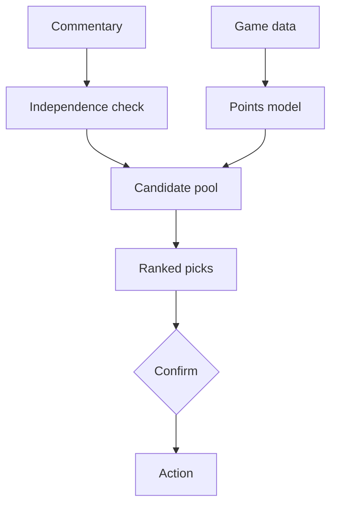

<b>Many opinions in, one number-backed weekly decision out</b>

<b>Status:</b> In weekly use, private &nbsp;·&nbsp; <b>Built by</b> <a href="https://github.com/Mohanad1st">Mohannad Hesham</a>

> This is a case study. The source is private because it is a personal tool.

## Why I built it

A side project. Every Fantasy Premier League gameweek there are a dozen opinions and a deadline. This tool reads the official game data and public expert commentary, checks whether those sources are actually independent or just repeating each other, and produces ranked, evidence-backed recommendations.

## What it does

- A weekly report with ranked transfer and captain picks.
- An expected-points model based on form, fixtures and availability.
- Cross-checks against video and blog sources, and flags when they're only echoing each other.
- A staged action flow with a human confirmation step.

## How it works

Screens aren&#x27;t shown because the dashboard is private.

## What it's built on

Python · a hand-built HTML and SVG dashboard · plain configuration files · no database

## Safeguards

- Analysis is read-only and uses only public data.
- Any change to a real account needs a human confirmation. An optional unattended mode is off by default and sits behind several explicit switches.
- Every recommendation has to cite the data behind it.
- Scraped text is sanitised before it's shown.

## What it doesn't do

- It's a personal tool, not a product, and it isn't publicly accessible.

## More independent builds

- [GrantsAI](https://github.com/Mohanad1st/grantsai-showcase) — Find, judge and draft grant applications faster, for small NGOs

---

© 2026 Mohannad Hesham. Showcase text and images only — no source code is published or licensed here. See all my work on <a href="https://github.com/Mohanad1st">my GitHub profile</a> · <a href="https://www.linkedin.com/in/mohannadhesham/">LinkedIn</a>.
