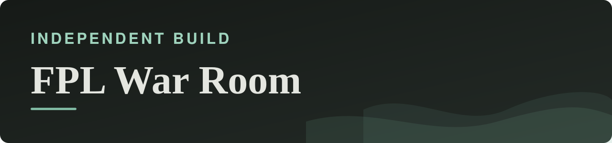
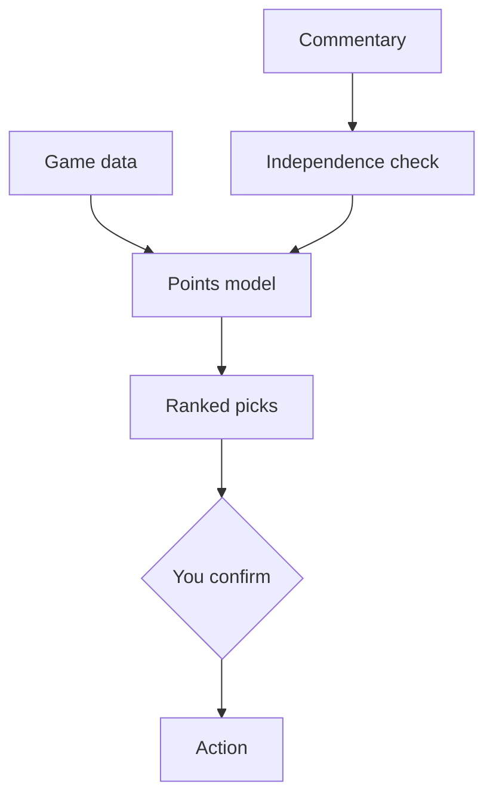

<b>Many opinions in, one number-backed weekly decision out</b>

<b>Status:</b> In weekly use, private &nbsp;·&nbsp; <b>Built by</b> <a href="https://github.com/Mohanad1st">Mohannad Hesham</a>

> Case study only: the source is private because it is a personal tool. Walkthrough on request.

## The problem

A side project, and a place to practise the same discipline I use at work. Every Fantasy Premier League gameweek there are a dozen opinions and a deadline. This tool reads the official game data and public expert commentary, checks whether those sources are actually independent or just repeating each other, and produces one ranked, evidence-backed recommendation.

## What it does

- A weekly report with ranked transfer and captain picks
- An expected-points model based on form, fixtures and availability
- Cross-checks against video and blog sources, flagging when they're only echoing each other
- A staged action flow with a human confirmation step

## See it

How the work flows:

Screens are not shown because the dashboard is private.

## Built with

Python · a hand-built HTML and SVG dashboard · plain configuration files · no database

## Built responsibly

- Analysis is read-only and uses only public data
- Any change to a real account needs a human confirmation; an optional unattended mode is off by default and sits behind several explicit switches
- Every recommendation has to cite the data behind it
- Scraped text is sanitised before it is shown

## What it deliberately doesn't do

- It is a personal tool, not a product, and it isn't publicly accessible.

## More independent builds

- [GrantsAI](https://github.com/Mohanad1st/grantsai-showcase) — Find, judge and draft grant applications faster, for small NGOs

---

© 2026 Mohannad Hesham. Showcase text and images only — no source code is published or licensed here. See all my work on <a href="https://github.com/Mohanad1st">my GitHub profile</a> · <a href="https://www.linkedin.com/in/mohannadhesham/">LinkedIn</a>.
